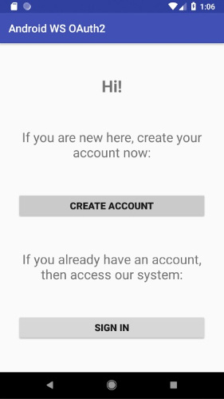
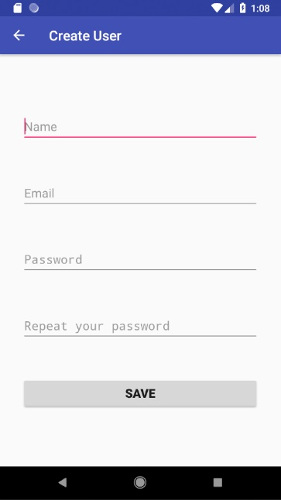
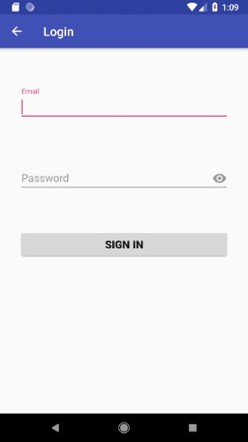
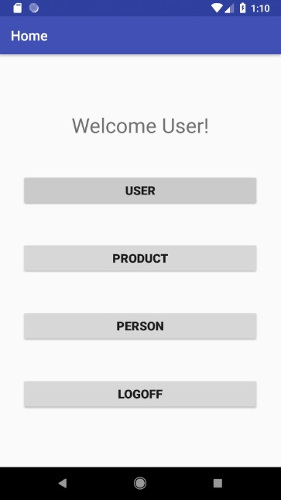
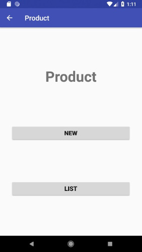
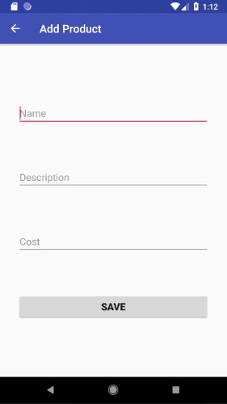
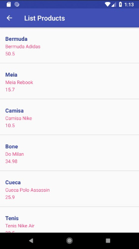
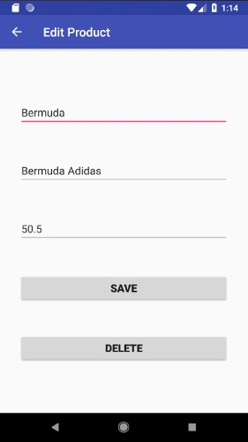

# Android Microservices

Android app consuming a Microservices with OAuth2.

## Getting Started

These instructions will get you a copy of the project up and running on your local machine for development and testing purposes. See deployment for notes on how to deploy the project on a live system.

### Prerequisites


* Android Studio or other.

* Microservices with Spring Cloud (Netflix): [spring-cloud-microservices](https://github.com/diogoaltoe/spring-cloud-microservices)


### Installing


```
Download the project by clicking the "Clone or download" button.
```
```
Unzip the project into the directory of your choice.
```
```
Using Android Studio (or another IDE), open the project you saved in the directory of your choice.
```
```
Click the Run (Shift + F10) button to run the project.

```


## Deployment

Another project, [spring-cloud-microservices](https://github.com/diogoaltoe/spring-cloud-microservices), will be the server that publish the services consumed in this project.


## Testing

You can download the APK file on [Releases Page](https://github.com/diogoaltoe/android-microservices/releases), install on Android and test the project.


## Screenshot

This are some of the App's screens:

### Visitor Home



### Create Account



### Sign In



### User Home



### Product Main



### New Product



### List Product



### Edit Product




## Built With

* [Gradle](https://gradle.org/) - Dependency Management.
* [Gson](https://github.com/google/gson) - A Java serialization/deserialization library to convert Java Objects into JSON and back.
* [HATEOAS (Hypermedia as the Engine of Application State)](https://spring.io/understanding/HATEOAS) - Constraint of the REST application architecture.
* [Jackson](https://github.com/FasterXML/jackson) - Known as the standard JSON library for Java.
* [OAuth2](https://oauth.net/2/) - Industry-standard protocol for authorization.
* [Spring's RestTemplate](https://docs.spring.io/autorepo/docs/spring-android/1.0.x/reference/html/rest-template.html) - Java-based REST client.

## Versioning

We use [Git](https://git-scm.com/) for versioning.

## Author

* **Diogo** - *Initial work* - [diogoaltoe](https://github.com/diogoaltoe)

## License

This project is licensed under the [MIT License](LICENSE.md).
